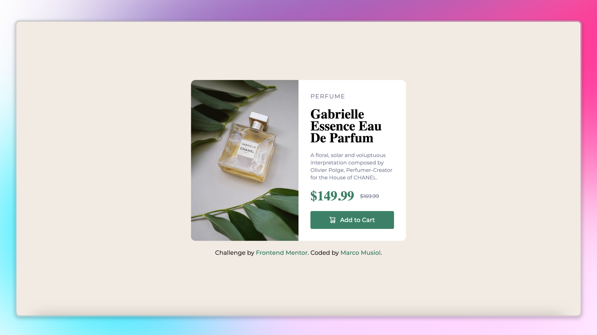
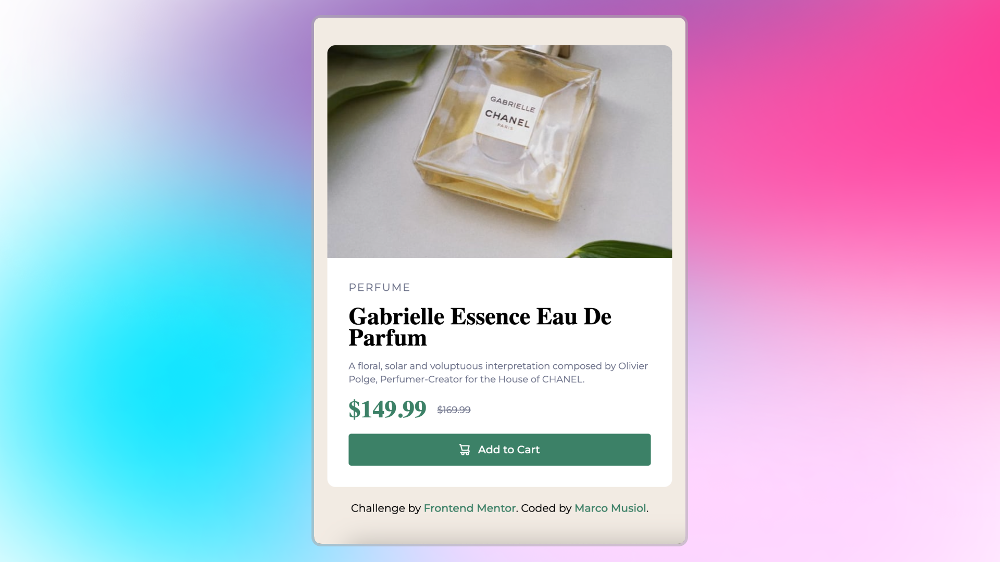

# Perfume Product Card Preview Solution 🌸

This is my solution for a [Frontend Mentor Challenge](https://www.frontendmentor.io) – a Perfume Product Card Preview. This project is built using **HTML5** and **Tailwind CSS**.

## 📸 Preview

## 🌐 Live Demo

Check out the live version here: [Live Site](#)

## 📂 Project Overview

This project focuses on creating a clean and responsive product card layout using **Tailwind CSS**. It includes hover states for interactive elements and follows a mobile-first design approach.

### Features ✨

- Mobile-first responsive design
- Hover states for buttons and links
- Custom fonts and colors configured in Tailwind CSS
- Flexible layout using Flexbox and Tailwind's utility classes

## 🛠️ Built With

- **HTML5**
- **Tailwind CSS**
- **Flexbox**

## 📖 What I Learned

- Configuring custom fonts and colors in Tailwind CSS
- Building mobile-first layouts with Tailwind's utility-first approach
- Enhancing interactivity with hover states
- Combining Flexbox with Tailwind CSS for flexible and responsive designs

## 🧑‍💻 Author

- Frontend Mentor Profile: [Marco Musiol](https://www.frontendmentor.io/profile/musiolmarco)
- GitHub: [Marco Musiol](https://github.com/musiolmarco)

## 🙌 Acknowledgments

A big thanks to [Frontend Mentor](https://www.frontendmentor.io) for providing these awesome challenges to improve front-end development skills.

---

### 📝 Notes

Feel free to fork this project and make it your own. If you have any suggestions or improvements, please open an issue or submit a pull request!

Happy coding! 🎉
